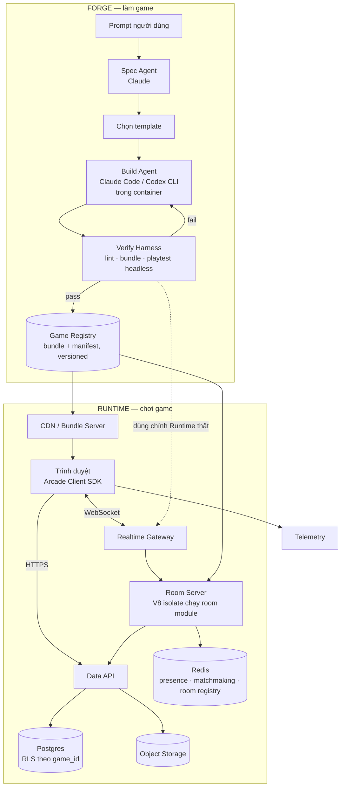
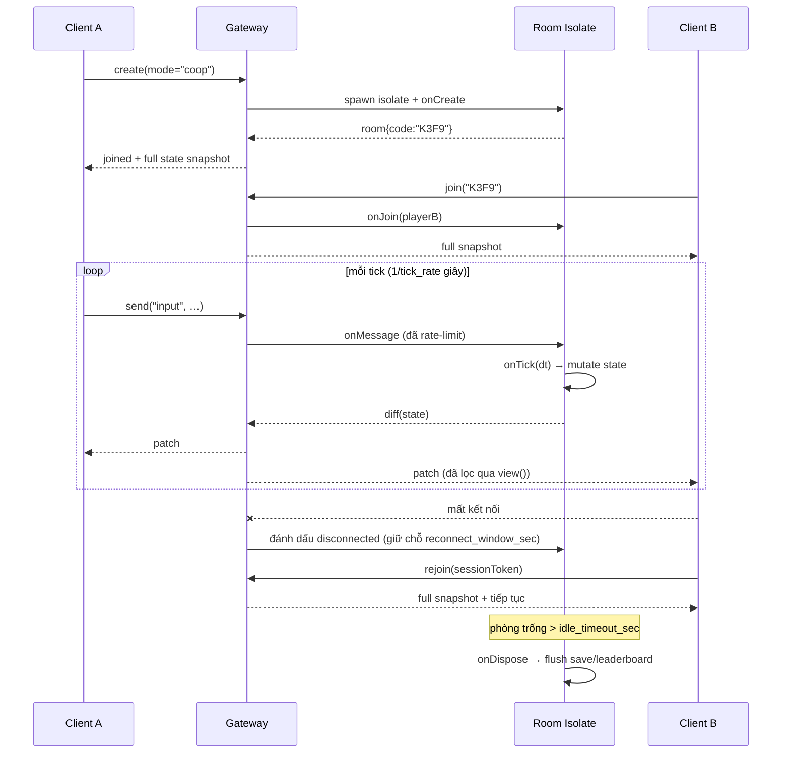
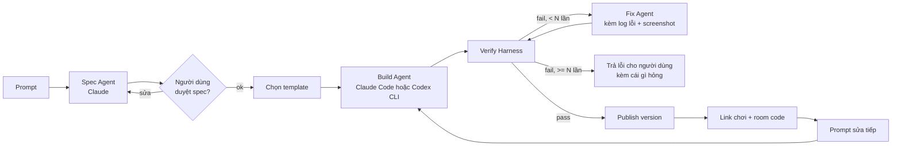

# Arcade — Platform làm game bằng prompt & backend "tận răng" cho game

> Bản thiết kế (design doc), chưa có code. Trạng thái: **draft để review**, không phải cam kết kỹ thuật.
> Ngày: 2026-09-06 · Thư mục tham chiếu: `~/goterm-workspace/games/`
> Đi kèm: [BUSINESS_MODEL.md](BUSINESS_MODEL.md) (thị trường, giá, định giá) · [SKILL_CHAIN.md](SKILL_CHAIN.md) (dây chuyền skill làm game = phần Forge)

---

## 0. Một câu

**Arcade = Supabase cho game.** Một backend batteries-included (auth, DB, storage, realtime, matchmaking,
leaderboard) mà *nhiều game khác nhau* cắm vào qua cùng một SDK — cộng thêm một lớp **AI Forge**:
người dùng gõ prompt, Claude/Codex build game trên đúng SDK đó, hệ thống tự verify rồi publish ra link chơi được.

Hai mặt phẳng tách bạch:

| | **Forge** (làm game) | **Runtime** (chơi game) |
|---|---|---|
| Người dùng | người mô tả game bằng prompt | người chơi |
| Đầu vào | prompt + template | link/room code |
| Đầu ra | game bundle đã verify | phiên chơi realtime |
| Có thể sống thiếu nhau? | Không (Forge cần Runtime để test) | **Có** — Runtime tự đứng được như một BaaS thương mại |

Điểm quan trọng: **Runtime phải có giá trị độc lập**. Nếu Forge chưa đủ tốt, Runtime vẫn là sản phẩm bán được
cho dev game indie. Nếu làm ngược lại (Forge trước, backend vá víu) thì game AI sinh ra sẽ không có chỗ chạy tử tế.

---

## 1. Mục tiêu

1. **Một game mới chỉ cần viết gameplay.** Không phải viết lại: phòng chơi, đồng bộ state, reconnect,
   lưu điểm, đăng nhập, deploy. Đó là công việc lặp lại ở cả 3 game hiện có.
2. **Một service, nhiều game.** Multi-tenant theo `game_id`, cách ly dữ liệu, quota riêng.
3. **Realtime multiplayer là công dân hạng nhất**, không phải add-on.
4. **Prompt → game chơi được**, với cổng kiểm tra tự động đủ chặt để kết quả không phải rác.
5. **Chạy được local** toàn bộ stack bằng 1 lệnh (DX kiểu `supabase start`).

### Non-goals (giai đoạn đầu — nói rõ để khỏi phình scope)

- Không làm engine 3D, không làm editor đồ hoạ. Canvas 2D + DOM trước.
- Không làm marketplace/thanh toán/economy tiền thật.
- Không làm anti-cheat nâng cao (behavior detection, ML). Chỉ dựa vào server authority + rate limit.
- Không hỗ trợ native client (Unity/Unreal) ở M0–M2. Web-first.
- Không tự host cho khách hàng enterprise (on-prem) trong năm đầu.

---

## 2. Học gì từ 3 game đang có

3 game trong `games/` chính là bộ test case đầu tiên — thiết kế bám vào chúng thay vì tưởng tượng:

| Game | Kiểu | Netcode hiện tại | Cái phải trừu tượng hoá |
|---|---|---|---|
| **tank-battle** | Co-op 4P realtime, browser + mobile | WebSocket, **server authoritative**, phòng mã 4 ký tự, link mời `?room=XXXX`, phòng trống tự xoá sau ~60s | Room lifecycle, mã phòng, link mời, state sync, GC phòng, tick loop |
| **castle** | 1P, canvas, round 60s, có điểm/combo | Không có — chỉ static file server | Save data, leaderboard, share kết quả |
| **rumba** | 1P puzzle, có độ khó/mode | Không có — chỉ static file server | Save data, daily challenge, leaderboard |

Ba quan sát rút ra:

1. **Cả 3 game đều tự viết một static file server gần y hệt nhau** (`server.js` ~50 dòng, map MIME type).
   → Platform phải nuốt trọn phần này: dev không viết server tĩnh nữa.
2. **tank-battle đã tự nghĩ ra room code + invite link + GC phòng.** Đây là pattern chung, không phải
   đặc thù game bắn tăng → đẩy lên platform.
3. **Ranh giới rõ ràng giữa "game offline" và "game có phòng".** Abstraction phải cho phép game
   *không* dùng realtime mà vẫn dùng được leaderboard/save — chứ không ép mọi game vào mô hình phòng.

> **Bài test của abstraction (M1):** port `tank-battle` sang SDK và **xoá được `server.js` + toàn bộ code
> netcode thủ công**, gameplay giữ nguyên. Nếu không xoá được, abstraction sai.

---

## 3. Kiến trúc tổng thể



Nguyên tắc: **Forge không có đường tắt.** Game do AI sinh ra chạy trên đúng runtime, đúng SDK, đúng
sandbox như game do người viết. Không có API nội bộ đặc quyền.

---

## 4. Trừu tượng hoá cốt lõi

Đây là phần quan trọng nhất của tài liệu. Mọi thứ khác là chi tiết triển khai.

### 4.1 Một game = 1 bundle tĩnh + (tuỳ chọn) 1 Room Module

```
my-game/
├── arcade.toml          # manifest — hợp đồng giữa game và platform
├── client/              # asset tĩnh, CDN phục vụ
│   ├── index.html
│   └── game.js          # dùng Arcade Client SDK
└── server/
    └── room.js          # TUỲ CHỌN — logic authoritative, chạy trong isolate của platform
```

- Game 1 người (castle, rumba): **không có** `server/`. Vẫn dùng được save/leaderboard.
- Game nhiều người (tank-battle): có `server/room.js`, không cần viết WebSocket, không cần deploy.

### 4.2 `arcade.toml` — hợp đồng khai báo

```toml
[game]
id       = "tank-battle-90"
name     = "Tank Battle 90"
version  = "1.4.0"
engine   = "canvas2d"          # canvas2d | dom | webgl
orientation = "portrait"        # gợi ý cho mobile shell

[runtime]
mode                = "authoritative"   # authoritative | relay | offline
tick_rate           = 30                # Hz, chỉ dùng khi có room module
max_players         = 4
idle_timeout_sec    = 60                # phòng trống bao lâu thì thu hồi
reconnect_window_sec = 30

[capabilities]                 # allowlist — không khai báo = không được gọi
save        = true
leaderboard = ["daily", "alltime"]
storage     = false            # UGC upload
presence    = true

[limits]                       # platform ép cứng, không phải gợi ý
state_bytes   = 65536          # kích thước tối đa room.state
msg_per_sec   = 30             # rate limit input mỗi player
bundle_bytes  = 5242880
cpu_ms_per_tick = 8
```

Manifest là thứ khiến platform **an toàn với game do AI sinh ra**: capability không khai báo thì SDK
không expose, và limit là hard limit ở tầng gateway/isolate chứ không tin vào code game.

### 4.3 Ba mô hình authority — chọn bằng 1 dòng config

| `mode` | Ai giữ chân lý | Chi phí | Chống cheat | Dùng cho |
|---|---|---|---|---|
| `authoritative` | Room server tick trên platform | Cao nhất (CPU/phòng) | Tốt | tank-battle, game action, có xếp hạng |
| `relay` | Client, server chỉ chuyển tiếp + thứ tự hoá | Rẻ | Không | game co-op vui vẻ, vẽ chung, party game |
| `offline` | Client, không có phòng | ~0 | N/A | castle, rumba |

Chuyển giữa 3 mode **không đổi code gameplay client** — chỉ đổi manifest và bỏ/thêm `room.js`.
Đây là điều làm platform này khác một thư viện netcode.

### 4.4 Room Module — hợp đồng phía server

```js
// server/room.js  — chạy trong V8 isolate, không có fs/net/child_process
export default {
  // state là JSON thuần. Platform tự diff và gửi delta cho client. Game KHÔNG tự serialize.
  initialState: () => ({ phase: 'lobby', players: {}, bullets: [], stage: 1 }),

  onCreate(room, opts)          {},   // opts từ người tạo phòng
  onJoin(room, player)          {},   // player: { id, name, isHost }
  onMessage(room, player, type, payload) {},  // input từ client, đã qua rate limit
  onTick(room, dt)              {},   // gọi tick_rate lần/giây; nơi chạy physics
  onLeave(room, player, reason) {},   // reason: 'left' | 'timeout' | 'kicked'
  onDispose(room)               {},   // flush dữ liệu bền vững trước khi phòng chết

  // TUỲ CHỌN — interest management / hidden information.
  // Trả về phần state mà player này được thấy. Không định nghĩa = thấy hết.
  view(room, player) { return room.state },

  // TUỲ CHỌN — chỉ room server mới được submit điểm ở mode authoritative
  onScoreSubmit(room, player, score) { return score <= room.state.maxPossible },
}
```

API mà `room` cung cấp:

```js
room.state            // object; mutate trực tiếp, platform diff sau mỗi tick
room.players          // Map<playerId, Player>
room.broadcast(type, payload, { except })
room.send(playerId, type, payload)
room.lock() / room.unlock()          // chặn người mới vào
room.setTickRate(hz)                 // trong khoảng manifest cho phép
room.save(key, value)                // ghi vào DB của game, flush khi dispose
room.leaderboard('daily').submit(playerId, score)
room.dispose()
room.log(...)                        // vào telemetry, không phải stdout
```

**Quyết định thiết kế & đánh đổi:**

- *State là JSON thuần, platform diff bằng structural diff* → dev không học schema DSL, AI sinh code dễ hơn
  nhiều. Đánh đổi: tốn CPU diff và băng thông hơn binary schema. Chấp nhận ở tick_rate ≤ 30 và
  `state_bytes ≤ 64KB`. Nếu cần hơn: mở đường `state.binary = true` với schema khai báo ở M3, **không**
  làm sớm.
- *Isolate (V8) thay vì container mỗi phòng* → cold start ms thay vì giây, mật độ phòng cao. Đánh đổi:
  không chạy được native module, phải ép API surface hẹp. Với game 2D JS thì đủ.
- *Chọn JavaScript cho room module* → cùng ngôn ngữ với client (dev viết 1 thứ tiếng), và là ngôn ngữ
  LLM sinh tốt nhất. Đánh đổi: mất dev C#/Go. Chấp nhận, vì đối tượng là web indie + AI-generated.

### 4.5 Client SDK

```js
import { Arcade } from '@arcade/client'

const arcade = await Arcade.init({ gameId: 'tank-battle-90' })   // key nằm trong bundle, public

// --- Auth: guest trước, nâng cấp sau ---
const me = await arcade.auth.guest({ name: 'Ngoc' })   // không cần đăng ký để chơi
await arcade.auth.link('google')                        // giữ nguyên tiến độ

// --- Phòng ---
const room = await arcade.rooms.create('coop', { stage: 1 })
console.log(room.code, room.inviteUrl)        // "K3F9", "https://play.arcade.gg/tank@1.4?room=K3F9"
const room2 = await arcade.rooms.join('K3F9')
const room3 = await arcade.rooms.quickMatch('coop')     // matchmaking

room.onState((state, patch) => render(state))  // gọi mỗi khi có delta
room.onEvent('explosion', p => sfx.play(p))
room.onPlayerJoin(p => toast(`${p.name} vào phòng`))
room.onDisconnect(() => showReconnecting())    // SDK tự reconnect trong reconnect_window
room.send('input', { dir: 'up', fire: true })

// --- Dịch vụ dùng được cả khi KHÔNG có phòng (castle/rumba dùng đúng phần này) ---
await arcade.save.set({ level: 7, unlocked: ['bomber'] })   // per-player, per-game
const save = await arcade.save.get()
await arcade.leaderboard('daily').submit(1240)
const top = await arcade.leaderboard('daily').top(20)
const rank = await arcade.leaderboard('daily').around(me.id, 5)
await arcade.storage.upload('maps/mymap.json', blob)        // nếu capability bật
arcade.track('round_end', { score: 1240, stage: 3 })
```

**Ràng buộc quan trọng:** ở mode `authoritative`, `arcade.leaderboard().submit()` từ client bị **từ chối**.
Chỉ room server submit được. Client tự nộp điểm chỉ cho phép ở mode `offline` — và điểm đó được đánh dấu
`unverified` trong bảng xếp hạng. Nói thẳng cho người dùng thay vì giả vờ chống cheat.

---

## 5. Dịch vụ backend ("tận răng" gồm những gì)

### 5.1 Auth
- **Guest-first**: `auth.guest()` cấp `player_id` + refresh token lưu localStorage. Chơi ngay, không form.
- Nâng cấp: Google / Apple / email OTP → merge tiến độ guest vào account thật.
- JWT ngắn hạn (15') mang `player_id` + `game_id`; gateway realtime verify chính token này.
- Không có "server key" trong bundle client. Mọi thứ trong bundle coi như public.

### 5.2 Data
Hai mặt tiền trên cùng một Postgres:

1. **Save Data** — mỗi (game, player) một document JSON ≤ 64KB, có version để chống ghi đè khi
   nhiều tab. Đây là thứ 90% game cần và là API đơn giản nhất.
2. **Tables** — game khai báo bảng trong `arcade.toml` (giai đoạn sau), platform sinh REST + typing,
   RLS mặc định `player_id = auth.player_id() AND game_id = current_game()`.

Mặc định phải an toàn: **không có bảng nào public-write** trừ khi khai báo rõ.

### 5.3 Storage
Object storage cho UGC (map tự vẽ, avatar, replay). Quota theo game và theo player. Upload đi qua
signed URL. Ảnh có content-type allowlist + giới hạn kích thước; có hook moderation ở M3.

### 5.4 Realtime — xem mục 6.

### 5.5 Matchmaking & Lobby
- `quickMatch(mode, { skill })`: hàng đợi trong Redis, ghép theo mode + dải MMR nới dần theo thời gian chờ.
- Room code 4 ký tự (bỏ ký tự dễ nhầm: `0/O`, `1/I`) + invite link — nâng nguyên pattern của tank-battle
  lên platform.
- Presence: "đang có N người chơi", danh sách bạn bè đang online.

### 5.6 Leaderboard & Stats
- Nhiều bảng mỗi game: `daily`, `weekly`, `alltime`, `stage-3`… khai báo trong manifest.
- Reset theo lịch, giữ snapshot kỳ trước.
- Redis sorted set cho đọc, Postgres là nguồn chân lý (ghi async, đọc từ cache).
- Chống cheat cơ bản: chỉ room server submit (mode authoritative), rate limit, chặn điểm vượt
  `onScoreSubmit`, flag outlier để review thủ công.

### 5.7 Telemetry & Replay
- Sự kiện tự động: `session_start`, `room_create`, `room_join`, `round_end`, `error`.
- `arcade.track()` cho sự kiện tuỳ ý.
- **Replay**: room server ghi lại input stream + seed. Với mode authoritative, replay = deterministic
  playback → dùng cho debug, xem lại trận, và (quan trọng) **làm test case tự động cho Forge**.
- Dashboard: CCU, phòng đang mở, tick time p50/p99, tỉ lệ lỗi client, retention D1/D7.

### 5.8 Dashboard & CLI
- Web dashboard: xem game, version, rollback, log phòng, số liệu.
- CLI: `arcade dev` (chạy toàn bộ stack local bằng Docker), `arcade deploy`, `arcade logs`,
  `arcade rooms ls`, `arcade typegen`.

---

## 6. Realtime engine — chi tiết

### 6.1 Vòng đời phòng



### 6.2 Đồng bộ state
- Sau mỗi tick: structural diff `prevState` vs `state` → mảng patch op (`set`/`del`/`splice`).
- Client nhận patch, apply, gọi `onState`. Không có "prediction" ở M1 — nói thẳng: game action nhanh
  sẽ thấy độ trễ theo RTT.
- **M3**: thêm client-side prediction + reconciliation cho entity mà game đánh dấu `owned by player`.
  Đây là tính năng khó, không hứa sớm.
- Full snapshot gửi khi: join, rejoin, hoặc client báo mất đồng bộ (checksum lệch).

### 6.3 Backpressure & bảo vệ
- Rate limit input: `msg_per_sec` ở gateway (token bucket), vượt → drop + cảnh báo, tái phạm → kick.
- `cpu_ms_per_tick`: isolate vượt ngân sách CPU → tick bị bỏ, log; vượt liên tục 30 tick → phòng bị
  dispose với lỗi rõ ràng cho dev. Một game xấu **không được** kéo sập host.
- `state_bytes` vượt → mutate bị từ chối, ném lỗi vào `room.log`.
- Mỗi isolate có memory cap; host chạy N isolate, có admission control theo CPU.

### 6.4 Chọn hạ tầng
| Thành phần | Chọn | Vì sao / đánh đổi |
|---|---|---|
| Transport | WebSocket | Có sẵn ở mọi trình duyệt & mobile web. WebTransport để M4 (giảm head-of-line blocking) |
| Room runtime | V8 isolate (Node `vm`/`isolated-vm`, hoặc Cloudflare Durable Objects/Workers) | Cold start thấp, mật độ cao. Durable Objects hợp mô hình "1 phòng = 1 object có state" gần như hoàn hảo — **nhưng** khoá vào một vendor. Quyết định ở M2 sau khi đo. |
| Registry phòng | Redis | Map `room_code → node`, presence, hàng đợi matchmaking |
| DB | Postgres | RLS sẵn, quen thuộc, đủ cho save/leaderboard/telemetry giai đoạn đầu |
| Bundle | Object storage + CDN | Bundle bất biến theo version, cache vĩnh viễn |

Sticky routing: client join theo `room_code` → Redis trả node → gateway proxy tới đúng node giữ isolate.

---

## 7. Mô hình dữ liệu (phác thảo)

```sql
-- Multi-tenant: mọi bảng dữ liệu game đều có game_id, RLS ép theo JWT.
create table games (
  id            text primary key,          -- "tank-battle-90"
  owner_id      uuid not null,
  name          text not null,
  created_from  text,                      -- 'human' | 'forge'
  created_at    timestamptz default now()
);

create table game_versions (
  game_id     text references games(id),
  version     text,                        -- semver
  manifest    jsonb not null,              -- arcade.toml đã parse
  bundle_uri  text not null,
  room_uri    text,                        -- null nếu mode = offline
  status      text,                        -- 'building'|'verifying'|'live'|'failed'|'rolled_back'
  verify_report jsonb,
  created_at  timestamptz default now(),
  primary key (game_id, version)
);

create table players (
  id           uuid primary key,
  is_guest     boolean default true,
  linked_email text,
  created_at   timestamptz default now()
);

create table saves (
  game_id   text, player_id uuid, data jsonb not null,
  version   int not null default 1,        -- optimistic locking
  updated_at timestamptz default now(),
  primary key (game_id, player_id)
);

create table leaderboard_entries (
  game_id text, board text, player_id uuid,
  score bigint not null,
  verified boolean default false,          -- true = do room server authoritative nộp
  meta jsonb, created_at timestamptz default now(),
  primary key (game_id, board, player_id)
);

create table rooms (                        -- ghi lịch sử, không phải state sống (state ở isolate)
  id uuid primary key, game_id text, code text,
  mode text, opened_at timestamptz, closed_at timestamptz,
  peak_players int, close_reason text
);

create table events (                       -- telemetry, phân vùng theo ngày
  game_id text, player_id uuid, name text,
  props jsonb, ts timestamptz default now()
);
```

RLS mặc định:
```sql
create policy own_save on saves
  using (player_id = auth.player_id() and game_id = auth.game_id());
```

---

## 8. AI Forge — prompt thành game

> Forge **không phải thiết kế mới** — nó là 5 skill trong [`skills/`](skills/) đã dùng để làm tank-battle,
> castle, rumba, chạy tự động: `/game-spec` → `/game-build` → `/game-playtest` → `/game-ship`, với
> `/game-iterate` là vòng sửa. Chi tiết và cách đóng gói 3 tầng: [SKILL_CHAIN.md](SKILL_CHAIN.md).
> Các skill file là **nguồn chân lý duy nhất**: Forge đọc chính chúng làm system prompt, không viết lại.

### 8.1 Đường đi



### 8.2 GameSpec — bước trung gian bắt buộc

Không cho agent nhảy thẳng từ prompt vào code. Spec Agent sinh JSON có cấu trúc:

```json
{
  "title": "Bắn tăng co-op",
  "genre": "action-arcade",
  "loop": "Diệt hết xe địch mỗi màn, bảo vệ đại bàng",
  "mode": "authoritative", "maxPlayers": 4,
  "entities": [{"name":"tank","props":["hp","dir","speed"]}],
  "controls": {"mobile":"dpad + nút bắn","desktop":"WASD + space"},
  "winCondition": "hết 20 xe địch",
  "loseCondition": "đại bàng bị phá hoặc hết mạng",
  "artDirection": "pixel 8-bit, palette 4 màu",
  "template": "canvas2d-authoritative-mp"
}
```

Lợi ích: (a) người dùng sửa spec rẻ hơn sửa code, (b) spec là input ổn định cho verify — sinh test case
từ `winCondition`/`controls`, (c) so sánh được nhiều lần build trên cùng một spec.

### 8.3 Template — giảm bề mặt tự do

| Template | Dùng cho | Có sẵn |
|---|---|---|
| `canvas2d-offline` | rumba, castle, puzzle, endless | game loop, input, save, leaderboard |
| `canvas2d-authoritative-mp` | tank-battle, .io game | room module mẫu, tick loop, lobby, reconnect UI |
| `turn-based-mp` | cờ, bài, quiz | quản lý lượt, timer, hidden info qua `view()` |
| `party-relay` | vẽ chung, đoán từ | relay mode, không tick server |

Template mang theo `AGENTS.md` + `CLAUDE.md` mô tả **hợp đồng SDK, capability được phép, giới hạn** —
đây là cách ép agent viết đúng thay vì cầu may. Kèm `.d.ts` của SDK để agent có typing.

### 8.4 Dùng Claude và Codex thế nào

Hai CLI, cùng chạy trong container có template + SDK, khác vai:

| Giai đoạn | Mặc định | Vì sao |
|---|---|---|
| Spec | Claude | Việc mở, cần hỏi lại người dùng |
| Build lần đầu | Claude Code | Sinh nhiều file + theo hợp đồng dài |
| Fix sau khi verify fail | Codex CLI | Đầu vào hẹp, cụ thể (log lỗi + diff) |
| Review trước publish | Bên còn lại với build | Chéo model bắt được lỗi model kia bỏ qua |
| Chế độ `--race` (tuỳ chọn) | Cả hai build song song | Lấy bản pass verify trước / chi phí thấp hơn |

**Đây là chính sách định tuyến, không phải chân lý.** Phải đo pass-rate và chi phí theo template rồi
chỉnh; ghi lại kết quả vào bảng đo, không đoán.

### 8.5 Verify Harness — thứ quyết định platform này có thật hay không

Prompt-to-game mà không có cổng kiểm tra thì chỉ là demo. Các cổng, chạy tuần tự, fail-fast:

**G1 — Tĩnh**
- `arcade.toml` hợp lệ; capability dùng trong code ⊆ capability khai báo.
- Bundle ≤ `bundle_bytes`; không có network call ra domain ngoài allowlist; không `eval`, không script từ CDN lạ.
- Room module parse được, không import module cấm.

**G2 — Boot** (Playwright headless)
- Trang load, 0 console error, canvas vẽ ra khung hình **khác màu nền** trong 3s (bắt màn hình đen).
- Không rò rỉ: 60s chạy, heap không tăng tuyến tính quá ngưỡng.

**G3 — Chơi được**
- Bơm chuỗi input theo `controls` trong spec → state phải đổi (bắt game "vẽ đẹp nhưng không tương tác").
- Chạy tới `winCondition` bằng bot script sinh từ spec → phải đến được màn thắng.
- Mobile viewport 390×844: không tràn ngang, vùng chạm ≥ 44px.

**G4 — Multiplayer** (chỉ khi `mode != offline`)
- 2 headless client join cùng room code → cả hai thấy state hội tụ (checksum khớp sau 3s).
- Ngắt 1 client → rejoin trong window → state đúng.
- Tick time p99 < ngân sách; `state_bytes` không vượt.

**G5 — Chi phí**
- CPU/tick, băng thông/người/phút trong hạn mức; nếu vượt → fail kèm số liệu, không publish âm thầm.

Fail → gửi lỗi + screenshot + log về Fix Agent, tối đa **N=3** vòng, có trần token. Hết vòng thì trả về
cho người dùng kèm mô tả *cái gì hỏng* — không im lặng publish game hỏng.

### 8.6 Vòng lặp sửa
Người dùng chơi → "làm địch nhanh hơn", "thêm boss màn 3" → Fix Agent nhận **diff-based patch** trên
version hiện tại (không build lại từ đầu) → verify lại → version mới. Mọi version bất biến, rollback 1 click.

### 8.7 Kiểm soát chi phí & lạm dụng
- Trần token/generation, trần số generation/người/ngày.
- Cache: template + SDK typing được cache prompt; chỉ phần spec-specific là mới.
- Game do AI sinh vẫn là UGC → cần moderation (text, ảnh) trước khi public vào catalog. Game private
  qua link thì nới hơn.

---

## 9. Sandbox & bảo mật

| Ranh giới | Rủi ro | Biện pháp |
|---|---|---|
| Bundle client | XSS sang origin platform | Mỗi game chạy ở **origin riêng** (`<gameid>.play.arcade.gg`) + CSP chặt; SDK nói chuyện với API qua CORS có allowlist |
| Room isolate | Code game (hoặc AI sinh) chạy trên hạ tầng chung | V8 isolate, không fs/net/process; CPU + memory cap; timeout; API surface allowlist theo manifest |
| Build container | Agent chạy lệnh tuỳ ý | Container ephemeral, không secret thật, network egress allowlist (npm registry + API model), FS chỉ ghi trong workspace |
| Dữ liệu người chơi | Game A đọc dữ liệu game B | RLS bắt buộc `game_id`; JWT gắn `game_id`; không có service key ở client |
| Điểm số | Cheat | Server authority; client submit → gắn cờ `unverified`; rate limit; `onScoreSubmit` |

Nói rõ giới hạn: ở mode `relay` và `offline`, **không có chống cheat**. Đừng bán ngược lại.

---

## 10. DX — local dev

```bash
npx create-arcade-game my-game --template canvas2d-authoritative-mp
cd my-game
arcade dev            # Postgres + Redis + gateway + isolate runner + static server, hot reload
arcade typegen        # sinh .d.ts từ arcade.toml (state, event, board)
arcade test           # chạy chính G1–G4 tại local
arcade deploy         # build, verify, publish version mới
arcade rollback 1.3.0
```

`arcade test` dùng **cùng harness với Forge**. Dev người thật và agent bị chấm cùng một thước đo —
điều này cũng có nghĩa harness phải đủ nhanh để chạy local (< 60s cho G1–G3).

---

## 11. Roadmap

| Mốc | Nội dung | Tiêu chí "xong" (đo được) |
|---|---|---|
| **M0** — Nền (2–3 tuần) | Postgres + auth guest + save + leaderboard + static bundle serving + CLI `dev/deploy` | **castle và rumba** bỏ `server.js`, chạy trên platform, có save + bảng xếp hạng thật |
| **M1** — Realtime (4–6 tuần) | Gateway WS, room isolate, state diff/patch, room code + invite link, reconnect, GC phòng | **tank-battle** port sang SDK, **xoá `server.js` và toàn bộ netcode thủ công**, 4 người chơi cùng qua LAN/internet, p99 tick < 8ms |
| **M2** — Forge v1 (4–6 tuần) | Spec agent, 2 template offline, build bằng Claude Code + Codex, harness G1–G3 | 10 prompt mẫu → **≥ 6** ra game pass verify không cần người can thiệp; đo pass-rate theo model |
| **M3** — Forge MP + hoàn thiện | Template MP, harness G4–G5, storage/UGC, matchmaking, dashboard, moderation | Prompt sinh được game 2 người chơi pass G4; có 1 game ngoài (không phải của mình) chạy production |
| **M4** — Quy mô | Prediction/reconciliation, binary state (opt-in), WebTransport, quota/billing | 500 CCU trên 1 node isolate với game mẫu; chi phí/CCU đo được |

Nguyên tắc thứ tự: **Runtime trước, Forge sau.** Lý do ở mục 0 — và vì Forge cần harness, mà harness cần
Runtime thật để chạy.

---

## 12. Rủi ro & câu hỏi mở

**Rủi ro**
1. *Structural diff không đủ rẻ* cho game có nhiều entity (bullet, particle). Giảm nhẹ: đo sớm ở M1 với
   tank-battle thật; có sẵn đường thoát là binary schema opt-in. Nếu M1 đo thấy p99 tick vượt ngân sách,
   phải quay lại thiết kế state chứ không vá.
2. *Chất lượng game AI sinh chạm trần nhanh.* Game "chơi được" ≠ "vui". Verify bắt được cái thứ nhất,
   không bắt được cái thứ hai. Giảm nhẹ: template chất lượng cao + thư viện cơ chế gameplay sẵn, và
   đặt kỳ vọng đúng khi truyền thông.
3. *Khoá vendor* nếu chọn Durable Objects. Giảm nhẹ: room module không được biết mình chạy ở đâu;
   giữ một adapter self-host để giữ đường lui.
4. *Chi phí LLM/generation* vượt giá trị thu được. Giảm nhẹ: trần token, cache, đo cost/generation từ M2.
5. *Moderation UGC* — game do người lạ prompt ra rồi public. Cần có trước khi mở catalog công khai.

**Câu hỏi mở (cần quyết trước M1/M2)**
- Room isolate: tự host `isolated-vm` hay Durable Objects? → quyết ở M2 sau khi đo cold start + chi phí.
- Prediction có phải điều kiện cần cho game action không, hay 30Hz + RTT nội địa là đủ? → đo bằng
  tank-battle với người chơi thật.
- Forge public (ai cũng prompt được) hay chỉ mở cho tài khoản đã xác thực? Ảnh hưởng lớn tới moderation
  và chi phí.
- Mô hình giá: theo CCU, theo phòng-phút, hay theo generation? Ảnh hưởng ngược lại vào thiết kế quota.

---

## 13. Prior art

Không phát minh lại — nói rõ đứng trên vai ai và khác ở đâu:

| Sản phẩm | Mạnh | Arcade khác gì |
|---|---|---|
| **Colyseus** | Room + state sync tốt, self-host | Arcade thêm auth/DB/storage/leaderboard managed + Forge |
| **Nakama** | BaaS game đầy đủ, Go, self-host | Arcade nhắm web-first, JS-only, DX kiểu Supabase, có AI Forge |
| **PlayFab / Photon** | Trưởng thành, quy mô lớn | Nặng, hướng studio; Arcade hướng indie/web/AI |
| **Supabase** | DX và mô hình RLS đáng học | Không có realtime authoritative kiểu game, không có room/tick |
| **Rosebud / Websim** | Prompt ra game | Chủ yếu single-player, không có backend đứng riêng được |

Vị trí muốn chiếm: **Colyseus (runtime) + Supabase (DX & batteries) + verify harness nghiêm túc cho AI.**
Khác biệt phòng thủ được lâu nhất không phải là "AI sinh game" — mà là **harness + runtime** khiến game
AI sinh ra thực sự chạy được cho nhiều người chơi.

---

## Phụ lục A — tank-battle sau khi port (hình dung)

```js
// server/room.js  — thay thế toàn bộ server.js + netcode thủ công hiện tại
export default {
  initialState: () => ({ phase:'lobby', stage:1, tanks:{}, enemies:[], bullets:[], eagle:{hp:1} }),

  onJoin(room, player) {
    if (Object.keys(room.state.tanks).length >= 4) return room.reject('phòng đầy')
    room.state.tanks[player.id] = { x:96, y:400, dir:'up', lives:3, name:player.name }
    if (room.state.phase === 'lobby' && Object.keys(room.state.tanks).length >= 1) room.state.phase = 'play'
  },

  onMessage(room, player, type, p) {
    const t = room.state.tanks[player.id]
    if (!t || type !== 'input') return
    t.dir = p.dir; t.firing = !!p.fire          // rate limit đã do platform lo
  },

  onTick(room, dt) {
    stepTanks(room.state, dt); stepBullets(room.state, dt); stepEnemies(room.state, dt)
    if (room.state.eagle.hp <= 0) endRound(room, 'eagle_destroyed')
  },

  onLeave(room, player) { delete room.state.tanks[player.id] },

  onDispose(room) {
    for (const [id, t] of Object.entries(room.state.tanks))
      room.leaderboard('alltime').submit(id, t.score ?? 0)
  },
}
```

Biến mất khỏi repo game: static file server, quản lý WebSocket, tạo/GC phòng, sinh mã phòng, invite link,
reconnect, broadcast state — **~40% code hiện tại không phải gameplay**.
