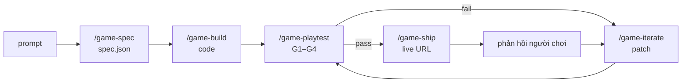

# Dây chuyền skill làm game → đóng gói vào platform

> 5 skill trong [`skills/`](skills/) là **dây chuyền sản xuất** đã dùng để làm tank-battle, castle, rumba.
> Đây cũng chính là phần Forge của [PLATFORM_DESIGN.md](PLATFORM_DESIGN.md) — không phải hai thứ khác nhau.

---

## 1. Chuỗi

| Skill | Vào | Ra | Cổng chặn |
|---|---|---|---|
| `/game-spec` | prompt | `spec.json` | người duyệt spec |
| `/game-build` | spec + template | code chạy local | — |
| `/game-playtest` | code + spec | báo cáo pass/fail | **G1–G4, fail thì dừng** |
| `/game-ship` | code đã pass | URL công khai | verify 2 tầng (local + tunnel) |
| `/game-iterate` | phản hồi / log fail | patch nhỏ | chạy lại playtest |

Hai vòng lặp: **fix** (playtest ⇄ iterate, tối đa 3 vòng rồi trả về cho người) và
**cải tiến** (người chơi → iterate → playtest → ship).

## 2. Vì sao dây chuyền quan trọng hơn từng skill

Mỗi skill mang **tri thức đã trả giá** từ 3 game thật, không phải lý thuyết:

- `game-spec` bắt buộc tra cơ chế gốc khi clone — vì `rumba` chỉ đúng luật sau khi xác định đúng họ
  Binairo/Tohu-wa-Vohu (nghiệm duy nhất, ràng buộc `=`/`×`).
- `game-spec` bắt buộc khai `balance` — vì `castle` từng bắn cả trận mà HP không giảm
  (sát thương pháo < HP mỗi viên gạch, mà HP castle = số gạch).
- `game-build` chốt vanilla JS, mobile-first portrait, tách engine/UI, không cấp phát mỗi frame —
  bài học hiệu năng mobile của `tank-battle`.
- `game-ship` cảnh báo đường dẫn tuyệt đối trong plist — đúng lỗi đã xảy ra ngày 2026-09-06 khi gom
  3 game vào `games/`: service chết im lặng, không ai biết cho tới lúc mở trang.

Đây là lý do dây chuyền là tài sản: **model nào cũng sinh được code game; thứ không sao chép được là
tập lỗi đã gặp và các cổng chặn được dựng lên vì chúng.**

## 3. Đóng gói vào platform theo 3 tầng

| Tầng | Ai chạy | Hình thù | Trạng thái |
|---|---|---|---|
| **T1 — Skill local** | Người dùng gõ `/game-spec` trong Claude Code | 5 file `SKILL.md` trong `skills/` | **Xong, dùng được ngay** |
| **T2 — Forge agent** | Runner của platform, tự động | Cùng nội dung, đóng thành system prompt của Spec/Build/Fix Agent; `/game-playtest` thành harness CI | M2 |
| **T3 — Hộp prompt người dùng** | Người không code | Người dùng chỉ thấy ô nhập + link game; T1/T2 chạy ngầm | M2–M3 |

**Một nguồn chân lý duy nhất:** nội dung skill ở T1 là bản gốc. Forge (T2) đọc chính các file này làm
system prompt, không viết lại — nếu tách đôi thì hai bên trôi khỏi nhau và bug quay lại.
Cụ thể: mỗi template trong platform mang theo `AGENTS.md` + `CLAUDE.md` được sinh từ `skills/game-build/SKILL.md`,
và `arcade test` chạy đúng các cổng trong `skills/game-playtest/SKILL.md`.

**Hệ quả:** người thật và agent bị chấm bằng **cùng một thước đo**. Đó là điều kiện để tin kết quả của Forge.

## 4. Định tuyến model (theo phân tích chi phí trong BUSINESS_MODEL.md)

| Skill | Model mặc định | Vì sao |
|---|---|---|
| `/game-spec` | Opus 5 | Việc mở, cần hỏi lại, cần tra cứu — chất lượng ở đây quyết định mọi bước sau |
| `/game-build` | Sonnet 5 | Sinh nhiều file theo hợp đồng chặt; đây là bước tốn token nhất → dùng model rẻ hơn |
| `/game-playtest` | không cần LLM | Là script + browser headless. **Cổng chặn phải xác định, không được để model tự chấm mình** |
| `/game-iterate` | Sonnet 5, hoặc Codex CLI khi fix từ log | Đầu vào hẹp và cụ thể |
| Review trước ship | model chéo với bên build | Bắt lỗi mà model kia bỏ qua |

Ước tính: **~$0,55/game với Sonnet 5**, ~$1,38 nếu chạy toàn bộ bằng Opus 5.
Đây là con số quyết định số credit mỗi gói giá.

## 5. Dùng ngay

5 skill đã được symlink vào `~/.claude/skills/` → gõ `/game-spec`, `/game-build`, `/game-playtest`,
`/game-ship`, `/game-iterate` trong bất kỳ session nào. Sửa file trong `games/skills/` là cập nhật luôn
(symlink, không phải bản sao). Gỡ: xoá symlink trong `~/.claude/skills/`.
